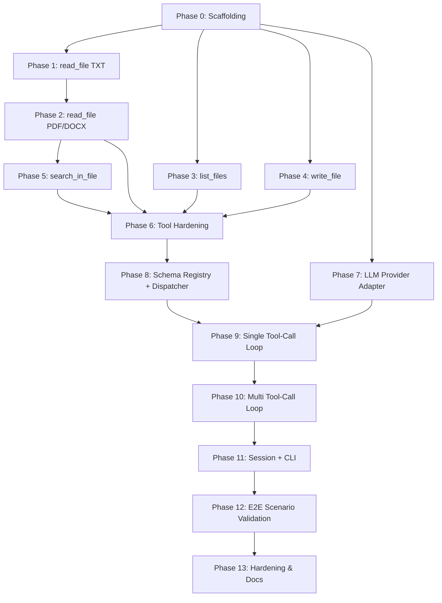

# Implementation Plan: LLM-Powered File System Assistant

## 1. Purpose

This document breaks the architecture in `architecture.md` into incremental, independently testable phases. Each phase has a narrow scope, a clear exit criterion, and a testing strategy that does **not** depend on later phases — so the tool layer can be fully verified before any LLM is involved, and the orchestration layer can be verified with mocked tools before real file I/O is wired in. The final phases integrate everything into the end-to-end flows described in `problemStatement.md` §4.2.3.

**Guiding principle:** build bottom-up (file system → tools → schemas → single tool-call → multi tool-call loop → session → CLI), and at every phase produce a runnable, testable artifact — never a phase that only "compiles" but can't be exercised on its own.

## 2. Phase Overview

| Phase | Name | Primary Output | Depends On |
|---|---|---|---|
| 0 | Project Scaffolding | Repo structure, env, test harness | — |
| 1 | `read_file` — TXT support | Working TXT reader + unit tests | Phase 0 |
| 2 | `read_file` — PDF & DOCX support | Full multi-format reader | Phase 1 |
| 3 | `list_files` | Directory listing tool | Phase 0 |
| 4 | `write_file` | File-writing tool | Phase 0 |
| 5 | `search_in_file` | Keyword search tool | Phase 2 |
| 6 | Tool Layer Hardening | Path safety, consistent error contract | Phases 1–5 |
| 7 | LLM Provider Adapter (no tools) | Basic chat round-trip, provider-agnostic | Phase 0 |
| 8 | Tool Schema Registry & Dispatcher | Schema defs + name→function dispatch (mocked LLM) | Phases 6, 7 |
| 9 | Single Tool-Call Loop | One user query → one tool call → one final answer | Phase 8 |
| 10 | Multi-Tool-Call Loop | Chained/repeated tool calls until convergence | Phase 9 |
| 11 | Session/Conversation State + CLI | Multi-turn REPL + `run_query()` API | Phase 10 |
| 12 | End-to-End Scenario Validation | The 3 example queries pass fully | Phase 11 |
| 13 | Resilience, Logging & Docs Hardening | Production-readiness pass | Phase 12 |

Each phase below specifies: **Goal**, **Scope**, **Deliverables**, **Testing Strategy (isolated)**, **Exit Criteria**, and **Explicit Non-Goals** (what NOT to build yet, to keep phases decoupled).

---

## Phase 0 — Project Scaffolding

**Goal:** Establish a structure and test harness so every subsequent phase can add code and tests without rework.

**Scope:**
- Repository layout:
  ```
  project/
    fs_tools.py
    llm_file_assistant.py
    tests/
      test_fs_tools.py
      test_llm_file_assistant.py
      fixtures/
        sample.txt
        sample.pdf
        sample.docx
        empty.txt
        corrupt.pdf
    resumes/            # sample input dir for manual testing
    output/             # generated artifacts land here
    logs/
    requirements.txt
    README.md
  ```
- Set up `pytest` as the test runner.
- Add `requirements.txt` with placeholders: `pypdf`, `python-docx`, `pytest`, `openai` or `anthropic` (pin exact versions once chosen).
- Create fixture files (a real small PDF/DOCX/TXT resume, an empty file, and a deliberately corrupt PDF for error-path testing).

**Deliverables:**
- Empty `fs_tools.py` / `llm_file_assistant.py` with module docstrings.
- `pytest` runs successfully (even with zero real tests, a placeholder `test_scaffolding.py::test_imports` passes).
- Fixtures directory populated.

**Testing Strategy (isolated):** `pytest tests/` runs green with no import errors; fixtures are validated by hand-opening them once.

**Exit Criteria:** `pip install -r requirements.txt && pytest` succeeds with 0 failures on a clean checkout.

**Non-Goals:** No tool logic, no LLM code yet.

---

## Phase 1 — `read_file`: TXT Support

**Goal:** Implement the simplest slice of `read_file` end-to-end (TXT only) to lock in the function's contract (return shape, error shape) before adding parser complexity.

**Scope:**
- Implement `read_file(filepath: str) -> dict` for `.txt` only.
- Implement the full structured return shape from `problemStatement.md` §4.1.1 (`success`, `filepath`, `filename`, `extension`, `content`, `metadata`, `error`).
- Handle: missing file, empty file, permission error, non-UTF8 encoding (fallback), unsupported extension (return clean error, do not crash — this proves the "unsupported format" error path early).

**Deliverables:** `read_file()` supporting `.txt` with graceful errors for everything else.

**Testing Strategy (isolated — pure unit tests, no other module involved):**
- `test_read_file_txt_success()` — reads `fixtures/sample.txt`, asserts `success is True`, content matches, metadata fields present and correct (`size_bytes`, `num_words`, `num_characters`, `modified_time`).
- `test_read_file_missing_file()` — nonexistent path → `success is False`, non-null `error`, no exception raised.
- `test_read_file_empty_file()` — `fixtures/empty.txt` → defined behavior (e.g. `success is True`, `content == ""`) — decide and assert consistently.
- `test_read_file_unsupported_extension()` — `.xyz` file → `success is False`, descriptive `error`.
- `test_read_file_non_utf8()` — a latin-1 encoded fixture → either decodes with fallback or reports a clear error (pick one policy, test it).

**Exit Criteria:** All above tests pass; function never raises for any of the tested bad inputs (verified with `pytest.raises` explicitly asserting *no* exception, or simply that the call completes and returns a dict).

**Non-Goals:** No PDF/DOCX yet — those are Phase 2.

---

## Phase 2 — `read_file`: PDF & DOCX Support

**Goal:** Extend `read_file` to the two remaining formats without breaking the Phase 1 contract or tests.

**Scope:**
- Add PDF branch using `pypdf`/`pdfplumber`; populate `num_pages` in metadata.
- Add DOCX branch using `python-docx`; populate `num_pages` if derivable, else omit/None with documented behavior.
- Add corrupt-file handling: a malformed PDF/DOCX must return `success: False` with a descriptive error, not raise.

**Deliverables:** `read_file()` now fully supports `.pdf`, `.txt`, `.docx` per §4.1.1.

**Testing Strategy (isolated):**
- `test_read_file_pdf_success()` — `fixtures/sample.pdf`, asserts extracted text is non-empty and contains an expected known phrase, `num_pages` correct.
- `test_read_file_docx_success()` — same for `fixtures/sample.docx`.
- `test_read_file_corrupt_pdf()` — `fixtures/corrupt.pdf` → `success is False`, no exception.
- **Regression:** re-run all Phase 1 TXT tests to confirm no shared-code regression.
- Cross-format consistency test: assert all three formats return dicts with an identical *set of keys* (even if some values are `None`), so downstream callers (including the LLM) get a uniform shape.

**Exit Criteria:** All Phase 1 + Phase 2 tests green; `read_file` is feature-complete per the problem statement.

**Non-Goals:** No search/write logic yet.

---

## Phase 3 — `list_files`

**Goal:** Implement directory enumeration independently — this phase has no dependency on `read_file` and can be built/tested in parallel with Phases 1–2.

**Scope:**
- Implement `list_files(directory, extension=None) -> list` per §4.1.2.
- Extension filter tolerant of `.pdf` vs `pdf`, case-insensitive.
- Deterministic sort order (by name).
- Documented, tested behavior for: non-existent directory, empty directory, permission error, directory containing mixed file types and subdirectories (non-recursive by default).

**Deliverables:** Standalone `list_files()`.

**Testing Strategy (isolated):**
- `test_list_files_all()` — a fixture dir with 3 files → list of 3 dicts with correct keys (`name`, `filepath`, `extension`, `size_bytes`, `modified_time`).
- `test_list_files_filtered()` — same dir filtered by `.pdf` → only PDF entries returned.
- `test_list_files_case_insensitive_extension()` — filter `"PDF"` and `".PDF"` both work.
- `test_list_files_empty_dir()` — returns `[]`.
- `test_list_files_missing_dir()` — returns `[]` or documented error entry (per architecture §4.1.2 convention) — no exception.
- `test_list_files_ignores_subdirectories()` — a nested folder is not listed as a file and its contents are not surfaced (non-recursive default).

**Exit Criteria:** All tests green; function usable standalone via `python -c "from fs_tools import list_files; print(list_files('resumes'))"`.

**Non-Goals:** No recursive flag yet (stretch goal, deferred).

---

## Phase 4 — `write_file`

**Goal:** Implement file writing independently — no dependency on the read/list tools.

**Scope:**
- Implement `write_file(filepath, content) -> dict` per §4.1.3.
- Auto-create missing parent directories.
- Overwrite-by-default behavior, clearly documented.
- Structured success/failure return.

**Deliverables:** Standalone `write_file()`.

**Testing Strategy (isolated, using a temp directory via `tmp_path` pytest fixture to avoid polluting the repo):**
- `test_write_file_creates_new_dirs()` — write to `tmp_path/newdir/sub/out.txt` → directories created, `success is True`, `bytes_written` matches content length.
- `test_write_file_overwrites_existing()` — write twice to same path, second content replaces first.
- `test_write_file_permission_error()` — simulate a permission failure (e.g. read-only target dir) → `success is False`, descriptive `error`, no exception.
- `test_write_file_empty_content()` — writing `""` succeeds with `bytes_written == 0`.

**Exit Criteria:** All tests green; no test writes outside `tmp_path`.

**Non-Goals:** No overwrite-confirmation/versioning yet (stretch goal, deferred).

---

## Phase 5 — `search_in_file`

**Goal:** Implement keyword search, which is the first tool with an internal dependency (`read_file`) — build only after Phase 2 is stable.

**Scope:**
- Implement `search_in_file(filepath, keyword) -> dict` per §4.1.4, calling `read_file` internally.
- Case-insensitive matching.
- Context-window extraction around each match.
- `match_count: 0` / empty `matches` handled as a *successful* search with no hits (not an error).

**Deliverables:** Standalone `search_in_file()`.

**Testing Strategy (isolated, but explicitly exercises the Phase 1–2 `read_file` as a real dependency — this is intentional, since it's an internal composition, not cross-layer):**
- `test_search_case_insensitive()` — keyword `"python"` matches `"Python"` in `fixtures/sample.txt`.
- `test_search_multiple_matches()` — a fixture with 3 occurrences → `match_count == 3`, 3 context entries.
- `test_search_no_match()` — keyword not present → `success is True`, `match_count == 0`, `matches == []`.
- `test_search_unreadable_file()` — corrupt/missing file → `success is False` from the underlying `read_file` failure, propagated with a clear `error`, no exception.
- `test_search_context_window_correctness()` — assert the returned context string actually contains the keyword and a sensible amount of surrounding text.

**Exit Criteria:** All tests green.

**Non-Goals:** No fuzzy/regex search yet (out of scope per problem statement).

---

## Phase 6 — Tool Layer Hardening (Cross-Cutting)

**Goal:** Before touching any LLM code, harden the whole tool layer as a unit: this is the last "pure Python" phase and the one the orchestration layer will treat as a trusted black box.

**Scope:**
- Add path sanitization/sandboxing (reject `..` traversal, resolve to an allowed `BASE_DIR`) across all four tools.
- Normalize the error contract: confirm every function's error dict/list shape is consistent and documented in docstrings.
- Add basic logging hooks (function name, args, success/failure) — this logging interface will be reused by the orchestrator in Phase 13.

**Deliverables:** `fs_tools.py` v1.0 — feature-complete and hardened.

**Testing Strategy (isolated):**
- `test_path_traversal_rejected()` for each tool — `../../etc/passwd`-style paths are rejected with a clear error, not executed.
- Full regression run of all Phases 1–5 tests.
- Static review: confirm no function in `fs_tools.py` imports anything LLM-related (`grep -i "openai\|anthropic"` returns nothing in this file) — enforces the architecture's LLM-agnostic tool layer requirement.

**Exit Criteria:** 100% of `fs_tools.py` tests pass; module has zero LLM SDK imports; this module can now be "frozen" as a dependency for the rest of the plan.

---

## Phase 7 — LLM Provider Adapter (No Tools Yet)

**Goal:** Prove out basic LLM connectivity and the provider abstraction *before* introducing tool calling, so connectivity issues and tool-calling issues are never debugged simultaneously.

**Scope:**
- Implement a minimal `LLMProvider` interface, e.g. `send(messages: list) -> LLMResponse`, with one concrete implementation (OpenAI or Anthropic, per the chosen provider).
- No tool schemas, no `fs_tools` involved at all in this phase.
- A simple "echo/chat" capability: send a system + user message, get back plain text.

**Deliverables:** `llm_file_assistant.py` contains a working `LLMProvider` (or `OpenAIProvider`/`AnthropicProvider`) class.

**Testing Strategy (isolated):**
- **Unit test with a mocked HTTP/SDK client** (no real network call, no API key required in CI): `test_provider_sends_expected_payload()` asserts the adapter builds the correct request shape given input messages.
- **Manual/optional integration smoke test** (requires a real API key, run manually or behind a CI secret): send "Say hello in one word" and assert a non-empty text response comes back. This is the *only* phase-level test allowed to hit the real network, and it is kept separate from the automated suite (e.g. marked `@pytest.mark.integration`, skipped by default).

**Exit Criteria:** Mocked unit tests pass in CI without network access; manual smoke test confirms real connectivity once, with a valid key.

**Non-Goals:** No tool-calling yet.

---

## Phase 8 — Tool Schema Registry & Dispatcher

**Goal:** Wire the (already-frozen) tool layer to schema definitions and a dispatch mechanism, fully testable with a **mocked LLM** — i.e., prove the registry and dispatcher work without depending on real model behavior.

**Scope:**
- Define JSON schemas for all four tools (name, description, parameter types) per §7 of `architecture.md`.
- Build a `TOOL_REGISTRY = {"read_file": read_file, "list_files": list_files, ...}` mapping.
- Build a `dispatch_tool_call(name: str, arguments: dict) -> Any` function that validates the tool name exists, validates/coerces arguments, calls the real `fs_tools` function, and catches any dispatch-level errors (e.g. unknown tool name, missing required argument) into a structured error — this is a **new** error-handling layer distinct from the tool-internal error handling in Phase 6.

**Deliverables:** Schema registry + dispatcher, fully decoupled from any live LLM call.

**Testing Strategy (isolated — no LLM involved at all):**
- `test_dispatch_known_tool()` — simulate a tool-call request dict (as if it came from an LLM) for `list_files`, assert it correctly invokes the real function and returns its result.
- `test_dispatch_unknown_tool()` — a fabricated tool name → structured error, no exception, no crash.
- `test_dispatch_missing_required_argument()` — omit `filepath` for `read_file` → structured error surfaced back (to eventually be relayed to the LLM for retry).
- `test_schema_shapes_valid_json()` — every schema in the registry is valid JSON-schema-shaped (has `name`, `description`, `parameters.type == "object"`, etc.) for whichever provider format is targeted.

**Exit Criteria:** Dispatcher tests pass entirely offline/mocked; registry is ready to be handed to the Provider Adapter.

---

## Phase 9 — Single Tool-Call Loop

**Goal:** Integrate Phase 7 (provider) + Phase 8 (registry/dispatcher) into the smallest possible end-to-end slice: one user query that results in exactly one tool call and one final answer.

**Scope:**
- Extend the orchestrator to: send `{messages, tools}` to the LLM, detect a tool-call response, dispatch it, append the tool result to the conversation, send again, and return the LLM's final text answer.
- No looping/multi-call chaining yet — cap at exactly one tool-call round-trip for this phase (a hard assertion, not a soft cap) to isolate the mechanism.

**Deliverables:** A working `run_query()` (or equivalent) that can answer a single-tool-call query end-to-end.

**Testing Strategy (isolated where possible, plus one real integration test):**
- **Mocked-LLM integration test:** stub the provider to return a scripted tool-call response followed by a scripted final-answer response; assert the real `fs_tools.list_files` gets called with correct args and the final text is returned. This validates the *loop mechanics* without depending on real model reasoning.
- **Real, narrow integration test** (marked `integration`, run manually/CI-secret-gated): ask "List the files in the resumes folder" against the real LLM + real fixture `resumes/` dir; assert the tool was actually invoked (e.g. via a spy/log check) and the final answer mentions the fixture filenames.

**Exit Criteria:** Both the mocked and the one real single-tool-call scenario pass.

---

## Phase 10 — Multi-Tool-Call Loop

**Goal:** Generalize Phase 9's loop to support the LLM requesting multiple, possibly sequential/dependent tool calls before producing a final answer — this is required by all three example queries.

**Scope:**
- Replace the "exactly one call" assertion with a proper loop bounded by `MAX_TOOL_ITERATIONS`.
- Support the LLM issuing **multiple tool calls in a single response** (if the provider supports parallel tool calls) as well as **sequential** calls across loop iterations.
- Implement the max-iteration safety cutoff with a clear terminal message if exceeded (instead of silently returning nothing).

**Deliverables:** Full tool-call loop as described in `architecture.md` §5 (general pattern).

**Testing Strategy (isolated via mocked provider, deterministic scripts):**
- `test_loop_two_sequential_tool_calls()` — mock returns `list_files` call, then a `read_file` call, then a final answer; assert both tools were invoked in order and the loop terminated correctly.
- `test_loop_parallel_tool_calls_in_one_turn()` — mock returns two tool calls in a single LLM turn; assert both are dispatched and both results are fed back before the next LLM call.
- `test_loop_max_iterations_exceeded()` — mock always returns another tool call, never a final answer; assert the loop stops at `MAX_TOOL_ITERATIONS` and returns a graceful "unable to complete" message rather than hanging or crashing.
- `test_loop_tool_error_is_relayed_not_fatal()` — mock a tool call that dispatches to a deliberately failing case (e.g. missing file); assert the error is fed back as a tool result and the LLM mock can "see" it and produce a final answer acknowledging the failure.

**Exit Criteria:** All loop-mechanic tests pass against the mocked provider; no real LLM call needed for this phase (mechanics-only).

---

## Phase 11 — Session/Conversation State + CLI / `run_query()`

**Goal:** Add multi-turn memory and the two client entry points (CLI REPL and programmatic `run_query`) from `architecture.md` §3.1.

**Scope:**
- Wrap the Phase 10 loop in a `Session` object holding message history across multiple `run_query()` calls within one process run.
- Implement the CLI `__main__` REPL loop.
- Ensure `run_query(user_query: str) -> str` is usable both from the CLI and from an external import (e.g. a test or notebook).

**Deliverables:** `llm_file_assistant.py` is now runnable as `python llm_file_assistant.py`.

**Testing Strategy (isolated):**
- `test_session_maintains_history_across_calls()` — mocked provider; call `run_query` twice, assert the second call's outgoing message list includes the first turn's messages.
- `test_run_query_importable_without_cli()` — import `run_query` in a test file and call it directly (no subprocess), confirming it doesn't require the `__main__` guard to function.
- **Manual test:** run the CLI interactively, send 2–3 follow-up queries, confirm contextual continuity (e.g. "now do the same for the second one").

**Exit Criteria:** CLI runs; `run_query` importable and independently callable; multi-turn context confirmed.

---

## Phase 12 — End-to-End Scenario Validation

**Goal:** Validate the three example queries from `problemStatement.md` §4.2.3 against the fully assembled system, using the real LLM provider and real fixture files — this is the first phase where every layer is real (no mocks).

**Scope:** No new code ideally — this phase is about test-writing and any small bug fixes surfaced by real end-to-end runs.

**Deliverables:** An `tests/test_e2e_scenarios.py` (marked `integration`, requires API key) covering:
1. `test_e2e_read_all_resumes()` — asserts the final answer references all fixture resumes and no unhandled error occurred.
2. `test_e2e_find_python_resumes()` — asserts the final answer correctly identifies which fixture resumes mention "Python" (seed the fixtures so the expected answer is known in advance).
3. `test_e2e_create_summary_file()` — asserts `output/summary_resume_john_doe.txt` (or the LLM-chosen equivalent name) exists after the run, is non-empty, and the CLI's final answer confirms the write.

**Testing Strategy:** Real integration tests, run manually or in a gated CI job (requires API key + costs money per run — not part of the default fast test suite). Use deterministic, hand-authored fixture resumes so expected outcomes are known (e.g. exactly one fixture resume mentions "Python").

**Exit Criteria:** All three scenarios pass against the real system at least once, and are re-runnable without manual cleanup (tests should clean up `output/` files they create, or use a dedicated `output/test/` subfolder).

---

## Phase 13 — Resilience, Logging, and Documentation Hardening

**Goal:** Final production-readiness pass across the whole system, without changing core behavior.

**Scope:**
- Wire the logging hooks from Phase 6 into the orchestration loop (log every tool call: name, args, success/failure, duration).
- Add/confirm the system prompt content (tool usage guidance) per `problemStatement.md` §4.2.5.
- Review and finalize `requirements.txt` with pinned versions.
- Write/update `README.md` with setup, configuration (env vars per `architecture.md` §7), and usage examples.
- Optional stretch items, only after all above is stable: recursive `list_files`, overwrite-confirmation on `write_file`, additional file types.

**Deliverables:** Final polished `fs_tools.py`, `llm_file_assistant.py`, `requirements.txt`, `README.md`.

**Testing Strategy:**
- Full regression: run the entire non-integration test suite (Phases 1–11 tests) — must remain 100% green.
- Manual review of `logs/app.log` after a sample session to confirm useful, structured log entries.
- Fresh-clone test: a teammate (or CI job) clones the repo, follows only the README, and successfully runs the three example queries.

**Exit Criteria:** All success criteria from `problemStatement.md` §10 are met; fresh-clone test passes with no undocumented steps.

---

## 3. Testing Pyramid Summary

| Level | What's Tested | Real LLM? | Real File I/O? | Run Frequency |
|---|---|---|---|---|
| Unit — Tool Layer (Phases 1–6) | Each `fs_tools` function in isolation | No | Yes (fixtures/tmp_path) | Every commit (fast, free) |
| Unit — Orchestration Mechanics (Phases 8–10) | Registry, dispatcher, loop control flow | No (mocked) | Only via dispatched real tool calls in some tests | Every commit (fast, free) |
| Integration — Connectivity (Phase 7) | Provider adapter request/response shape | Optional smoke test | No | Manual / gated |
| Integration — Single/Multi Tool-Call (Phases 9–10) | Real LLM choosing correct tool(s) | Yes (narrow) | Yes | Manual / gated, low volume |
| End-to-End (Phase 12) | Full example-query scenarios | Yes | Yes | Manual / gated, before release |

This pyramid ensures the bulk of the test suite (tool layer + orchestration mechanics) runs fast, free, and deterministically on every commit, while real-LLM tests — which are slower, non-deterministic, and cost money — are isolated to a small, clearly marked integration tier exercised less frequently.

## 4. Dependency Graph (Build Order)



Phases 1–2, 3, and 4 can be developed **in parallel** by different contributors since they share no code paths until Phase 6. Phase 7 can also start in parallel with the tool-layer phases, since it has no dependency on `fs_tools.py` at all.