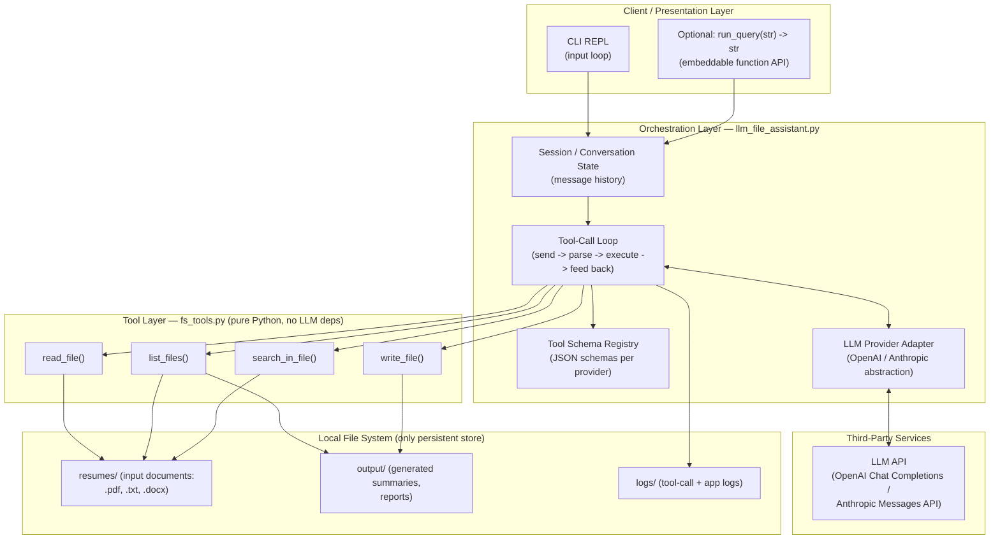
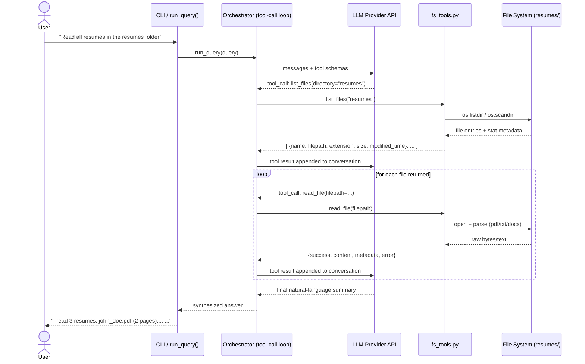
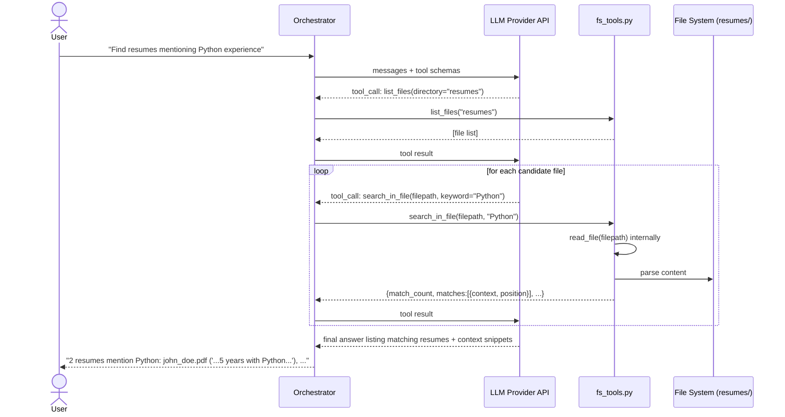
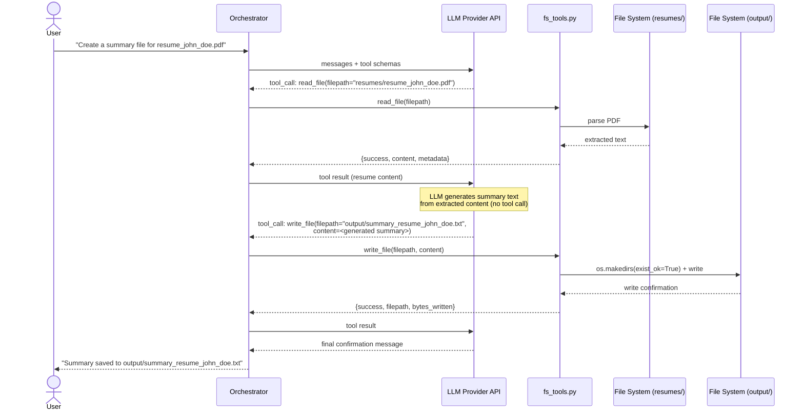
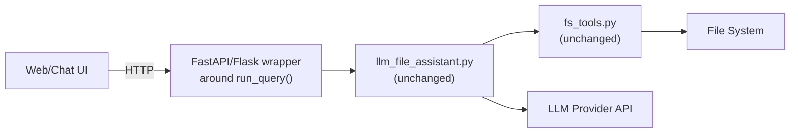

# Architecture: LLM-Powered File System Assistant

## 1. Purpose of This Document

This document describes the technical architecture for the system defined in `problemStatement.md`. It covers the overall system shape (client, orchestration layer, tool layer, storage, third-party services), the internal module boundaries, and the key data flows for the three representative user queries. It is intended for engineers implementing `fs_tools.py` and `llm_file_assistant.py`, and for reviewers evaluating design trade-offs.

## 2. Architectural Style

This is a **single-process, monolithic CLI/library application** with a clear internal layering, not a distributed system. There is no server, no persistent database, and no network-exposed API in the base scope — the only network calls are outbound requests to the chosen LLM provider's API. The architecture is intentionally simple and layered so that:

- The **tool layer** (`fs_tools.py`) is pure, synchronous, dependency-light Python with no knowledge of LLMs.
- The **orchestration layer** (`llm_file_assistant.py`) owns all LLM-specific logic (prompting, tool schemas, the tool-call loop) and is the only layer that talks to the outside world.
- The **local file system** acts as the system's only persistent store — there is no database.



## 3. System Shape

### 3.1 Frontend

There is no web/GUI frontend in the base scope. The "frontend" is one of:

| Interface | Description |
|---|---|
| **CLI REPL** | A simple `while True: input(...)` loop in `llm_file_assistant.py` (`__main__` block) that reads a user query, calls the orchestration function, and prints the response. This is the primary interface for manual testing and demos. |
| **Embeddable function API** | `run_query(user_query: str) -> str`, exposed for reuse by any future UI (web app, Slack bot, notebook, etc.) without modification to the orchestration internals. This is the extension point if a real frontend is added later. |

**Future extensibility (out of current scope, noted for architectural forward-compatibility):** a thin REST/WebSocket layer (e.g. FastAPI) or a chat UI could sit in front of `run_query()` without touching the tool or orchestration layers, since the boundary is already function-call based.

### 3.2 Backend / Orchestration Layer

`llm_file_assistant.py` is the "backend" of this system, structured into four internal responsibilities:

1. **Session/Conversation State** — an in-memory list of chat messages (system, user, assistant, tool) scoped to a single run of the CLI or a single caller of `run_query`. No cross-session persistence is required by the problem statement.
2. **LLM Provider Adapter** — isolates provider-specific request/response shapes (OpenAI `tools` + `tool_calls` vs. Anthropic `tools` + `tool_use`/`tool_result` content blocks) behind a small internal interface, e.g. `LLMProvider.send(messages, tools) -> LLMResponse` and `LLMProvider.format_tool_result(...)`. This satisfies the "swap providers with minimal change" goal.
3. **Tool Schema Registry** — a declarative mapping of tool name → JSON schema → Python callable, used both to build the `tools` payload sent to the LLM and to dispatch incoming tool-call requests to the right function in `fs_tools.py`.
4. **Tool-Call (Orchestration) Loop** — the control flow described in Section 5: send messages, inspect the LLM's response for tool-call requests, execute them against `fs_tools.py`, append results back into the conversation, and repeat until the LLM returns a final natural-language answer (with a max-iteration safety cap to prevent infinite loops).

### 3.3 Tool Layer

`fs_tools.py` is a pure, LLM-agnostic Python module — effectively a small internal "service layer" with four operations, all synchronous and side-effect-scoped to the local file system:

- `read_file(filepath) -> dict`
- `list_files(directory, extension=None) -> list`
- `write_file(filepath, content) -> dict`
- `search_in_file(filepath, keyword) -> dict`

This layer has zero knowledge of prompts, providers, or conversation state — it can be unit tested and reused independently (see `problemStatement.md` §4.1 for full functional detail). It is the only layer permitted to touch the file system.

### 3.4 Database

**None.** There is no relational, document, or vector database in this architecture. State is limited to:

- **In-memory conversation history**, scoped to the process lifetime (lost on exit unless a future enhancement adds persistence).
- **The file system itself** as the source of truth for documents (`resumes/`) and generated artifacts (`output/`).

If future requirements introduce semantic search across many resumes, a vector store (e.g. Chroma, FAISS, pgvector) would be added as a new component behind a `search_semantic()`-style tool, without changing the existing architecture's shape — it would slot in as an additional "Storage" component read/written by a new tool function.

### 3.5 Third-Party Services

| Service | Role | Notes |
|---|---|---|
| **LLM Provider API** (OpenAI Chat Completions API or Anthropic Messages API) | Natural-language understanding, tool-call planning/sequencing, and final response synthesis. | Only external network dependency. Accessed exclusively through the Provider Adapter in the orchestration layer. API key supplied via environment variable (e.g. `OPENAI_API_KEY` / `ANTHROPIC_API_KEY`). |
| **PDF parsing library** (`pypdf` / `pdfplumber`) | Local library, not a network service — extracts text from PDF files. | Runs in-process inside `read_file`. |
| **DOCX parsing library** (`python-docx`) | Local library — extracts text from DOCX files. | Runs in-process inside `read_file`. |

No other third-party/network services are required by the base scope (no cloud storage, no auth provider, no email/notification service).

## 4. Component Responsibilities (Summary Table)

| Component | Layer | Responsibility | Depends On |
|---|---|---|---|
| CLI REPL / `run_query()` | Client | Accept user input, display final answer | Orchestration layer |
| Session/Conversation State | Backend | Track message history for a session | — |
| Tool Schema Registry | Backend | Declare tool JSON schemas; map name → function | `fs_tools.py` |
| LLM Provider Adapter | Backend | Normalize requests/responses across providers | LLM API |
| Tool-Call Loop | Backend | Drive the send → tool-call → execute → respond cycle | Adapter, Registry |
| `read_file` | Tool | Extract text + metadata from PDF/TXT/DOCX | File system, parsing libs |
| `list_files` | Tool | Enumerate/filter files with metadata | File system |
| `write_file` | Tool | Persist content, auto-create directories | File system |
| `search_in_file` | Tool | Keyword search with context, case-insensitive | `read_file`, file system |
| Local File System | Storage | Source of truth for input docs and generated output | — |
| LLM API | Third-party | Query understanding, tool selection, summarization | — |

## 5. Key Data Flows

All three flows below follow the same general **tool-call loop** pattern:

```
1. User query -> appended to conversation as a "user" message
2. Orchestrator sends {messages, tool_schemas} to LLM Provider Adapter
3. LLM responds with either:
     a) a tool_call request (name + arguments), or
     b) a final natural-language answer
4. If (a): orchestrator dispatches to the matching fs_tools function,
   appends the tool's structured dict/list result to the conversation
   as a "tool" message, and returns to step 2 (loop, bounded by max_iterations)
5. If (b): the loop ends and the final answer is returned to the user
```

### 5.1 Flow: "Read all resumes in the resumes folder"



**Notes:**
- The LLM decides the number and order of `read_file` calls based on the `list_files` result — the orchestrator does not hardcode "read every file."
- Each `read_file` failure (e.g. a corrupt PDF) is fed back to the LLM as a tool result with `success: False`, allowing the LLM to report partial success rather than aborting the whole flow.

### 5.2 Flow: "Find resumes mentioning Python experience"



**Notes:**
- `search_in_file` internally reuses `read_file`, so no separate content-fetch step is needed by the orchestrator or the LLM.
- Case-insensitivity is handled inside the tool, not by the LLM or the orchestrator.

### 5.3 Flow: "Create a summary file for resume_john_doe.pdf"



**Notes:**
- The summary text itself is generated by the LLM as ordinary assistant content (not a tool call) between the `read_file` and `write_file` steps.
- `write_file`'s directory auto-creation means `output/` need not pre-exist.
- A stretch-goal confirmation step ("about to overwrite an existing file — proceed?") would insert an extra user-facing round trip before the `write_file` tool call is actually executed.

## 6. Error Handling & Resilience

- **Tool-level:** every `fs_tools.py` function returns a structured error (`success: False`, populated `error` field) instead of raising — this is a hard architectural invariant, since an unhandled exception inside the tool-call loop would otherwise crash the entire session.
- **Orchestration-level:**
  - The tool-call loop enforces a **max iteration count** (e.g. 8–10 tool calls per user query) to prevent infinite loops if the LLM repeatedly requests tools without converging on a final answer.
  - Malformed tool-call arguments from the LLM (e.g. missing required field) are caught and returned to the LLM as a tool error message so it can retry with corrected arguments, rather than crashing the orchestrator.
  - Provider/network errors (timeouts, rate limits, auth failures) are caught in the Provider Adapter and surfaced as a clear user-facing error rather than a stack trace.
- **Path safety:** all file paths passed to tools are resolved and checked against an allowed root directory (e.g. the project's working directory or a configured `BASE_DIR`) to prevent path traversal outside the intended sandbox — this check lives in `fs_tools.py` so it applies regardless of caller.

## 7. Configuration & Secrets

| Setting | Source | Example |
|---|---|---|
| LLM provider selection | env var or config value | `LLM_PROVIDER=openai` \| `anthropic` |
| API key | env var (never hardcoded/committed) | `OPENAI_API_KEY`, `ANTHROPIC_API_KEY` |
| Model name | env var or config | `LLM_MODEL=gpt-4o` / `claude-sonnet-4-6` |
| Base directory for file operations | env var or config default | `FS_BASE_DIR=./` |
| Max tool-call loop iterations | config constant | `MAX_TOOL_ITERATIONS=10` |
| Log level / log file path | env var or config | `LOG_LEVEL=INFO`, `LOG_FILE=logs/app.log` |

## 8. Deployment View

This system is designed to run as:

- A **local script/CLI** (`python llm_file_assistant.py`) on a developer machine, or
- An **importable library** (`from llm_file_assistant import run_query`) embedded in a larger application/notebook.

There is no containerization, load balancing, or multi-instance concern in the base scope, since there is no server component and no shared mutable state beyond the local file system. If a future web frontend is added (Section 3.1), the natural evolution is:



This preserves the existing module boundaries — the web layer becomes a thin new "Client" component calling the same `run_query()` function API, with no changes required to the orchestration or tool layers.

## 9. Traceability to Problem Statement

| Architecture Element | Problem Statement Reference |
|---|---|
| Tool Layer (`fs_tools.py`) | §4.1 (all four tool specs) |
| Orchestration Layer (`llm_file_assistant.py`) | §4.2 (LLM integration, orchestration loop, example queries) |
| No database, file system as store | §3 Non-Goals ("No persistent database or vector store") |
| Path safety / sandboxing | §6 Non-Functional Requirements — Security |
| Logging in orchestrator | §6 Non-Functional Requirements — Logging |
| Provider Adapter abstraction | §2 Goals — "LLM-agnostic tool layer"; §4.2.1 |
| Max-iteration safety cap | §6 Non-Functional Requirements — Robustness |