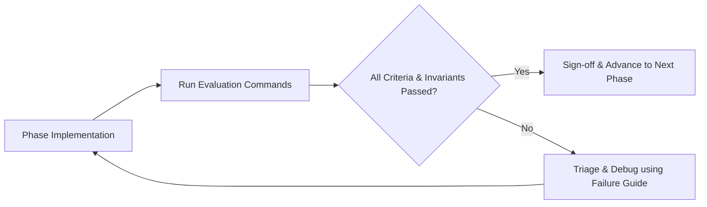

# Evaluation Framework & Phase Quality Gates: LLM-Powered File System Assistant

## 1. Overview and Purpose

This document provides actionable, deterministic evaluation criteria and quality gates for each of the 14 phases defined in [ImplementationPlan.md](file:///c:/Users/varad/Desktop/Gen%20AI/fsAssistant/docs/ImplementationPlan.md). 

Before marking any phase complete and advancing to the next phase, the engineer or automated CI pipeline must run the specified evaluation commands and verify that every item in the phase's **Go / No-Go Gate** is satisfied.



---

## 2. Evaluation Matrix & Gate Summary

| Phase | Phase Name | Evaluation Mode | Test Target | Gate Type | Primary Exit Metric |
|---|---|---|---|---|---|
| **0** | Project Scaffolding | Automated (Unit) | Clean env, directory tree, fixtures | Hard Gate | Clean checkout & `pytest` passes |
| **1** | `read_file`: TXT Support | Automated (Unit) | `fs_tools.py::read_file` (TXT) | Hard Gate | Contract verified, 0 unhandled exceptions |
| **2** | `read_file`: PDF & DOCX | Automated (Unit) | `fs_tools.py::read_file` (Multi) | Hard Gate | Uniform schema across all 3 formats |
| **3** | `list_files` | Automated (Unit) | `fs_tools.py::list_files` | Hard Gate | Deterministic sort, filtering, edge cases |
| **4** | `write_file` | Automated (Unit) | `fs_tools.py::write_file` | Hard Gate | Parent dir auto-creation, isolated writes |
| **5** | `search_in_file` | Automated (Unit) | `fs_tools.py::search_in_file` | Hard Gate | Case-insensitivity, context window sanity |
| **6** | Tool Layer Hardening | Automated (Security/Unit) | `fs_tools.py` v1.0 | Hard Gate | Path traversal blocked, zero LLM dependencies |
| **7** | LLM Provider Adapter | Mocked Unit + Smoke | `llm_file_assistant.py::LLMProvider` | Hard Gate | Request formatting verified; clean round-trip |
| **8** | Schema Registry & Dispatcher | Mocked Unit | `TOOL_REGISTRY` & `dispatch_tool_call` | Hard Gate | Valid JSON schemas, dispatch validation |
| **9** | Single Tool-Call Loop | Mocked Unit + Smoke | Single-iteration query flow | Hard Gate | Correct single-turn dispatch and synthesis |
| **10** | Multi-Tool-Call Loop | Mocked Unit (Simulated) | Iterative loop & parallel dispatch | Hard Gate | Loop converges, max-iteration guard triggers |
| **11** | Session State & CLI | Automated + Interactive | REPL, `Session`, `run_query()` | Hard Gate | Context preserved across turns, CLI functional |
| **12** | E2E Scenario Validation | Real Integration (Live API) | 3 Core queries from problem spec | Hard Gate | 3 real queries produce correct fs artifacts |
| **13** | Hardening, Logging & Docs | Regression + Fresh Clone | Full system, logs, docs | Release Gate | Fresh clone setup succeeds, zero regressions |

---

## Phase 0 — Project Scaffolding

### Objective
Establish the directory structure, environment dependencies, and test runner baseline before writing any tool or orchestration logic.

### Evaluation Checklist
- [ ] Directory structure matches specification:
  - `fs_tools.py` (stub with module docstring)
  - `llm_file_assistant.py` (stub with module docstring)
  - `tests/` containing `fixtures/`
  - `resumes/`, `output/`, `logs/` directories present or ignored
- [ ] `requirements.txt` contains required dependencies (`pytest`, `pypdf` or `pdfplumber`, `python-docx`, `openai` or `anthropic`, `python-dotenv`).
- [ ] Fixtures directory contains:
  - `sample.txt` (valid UTF-8 text resume)
  - `sample.pdf` (valid multi-page PDF resume)
  - `sample.docx` (valid formatted DOCX resume)
  - `empty.txt` (0-byte file)
  - `corrupt.pdf` (deliberately malformed binary data)
- [ ] Virtual environment installs cleanly without dependency conflicts.

### Verification Commands
```bash
# 1. Install dependencies
pip install -r requirements.txt

# 2. Run initial test suite
pytest tests/ -v
```

### Expected Output
```text
tests/test_scaffolding.py::test_environment_imports PASSED
tests/test_scaffolding.py::test_fixtures_present PASSED
============================== 2 passed in 0.12s ==============================
```

### Go / No-Go Gate
* **PASS**: `pytest` exits with code 0 on a clean environment checkout. All 5 fixtures exist and are non-empty (except `empty.txt`).
* **FAIL**: Any missing dependency, import error, or missing test fixture.

---

## Phase 1 — `read_file`: TXT Support

### Objective
Implement and verify the full return contract for `read_file()` on `.txt` files with error handling for non-existent, empty, and unsupported files.

### Evaluation Checklist
- [ ] Returns structured `dict` adhering to the exact contract:
  - Keys: `success`, `filepath`, `filename`, `extension`, `content`, `metadata`, `error`.
  - `metadata` keys: `size_bytes`, `num_words`, `num_characters`, `modified_time`, `read_time`.
- [ ] Gracefully handles missing files without raising an unhandled exception (`success: False`, descriptive `error`).
- [ ] Gracefully handles empty files (`success: True`, `content: ""`, `num_words: 0`).
- [ ] Rejects unsupported extensions (e.g., `.unknown`) with `success: False` and clean message.
- [ ] Handles non-UTF8 encodings using fallback (`latin-1` or `errors="replace"`).

### Verification Commands
```bash
pytest tests/test_fs_tools.py -k "read_file_txt" -v --tb=short
```

### Expected Contract Structure
```python
# Success Example
{
    "success": True,
    "filepath": "fixtures/sample.txt",
    "filename": "sample.txt",
    "extension": ".txt",
    "content": "John Doe\nSoftware Engineer...",
    "metadata": {
        "size_bytes": 1024,
        "num_words": 150,
        "num_characters": 950,
        "modified_time": "2026-09-26T10:00:00",
        "read_time": "2026-09-26T15:00:00"
    },
    "error": None
}

# Failure Example
{
    "success": False,
    "filepath": "fixtures/missing.txt",
    "filename": "missing.txt",
    "extension": ".txt",
    "content": None,
    "metadata": None,
    "error": "File not found: fixtures/missing.txt"
}
```

### Go / No-Go Gate
* **PASS**: 100% of TXT tests pass; return dictionary matches contract; function never raises an uncaught exception.
* **FAIL**: Any unhandled exception, missing contract key, or incorrect word/character count.

---

## Phase 2 — `read_file`: PDF & DOCX Support

### Objective
Extend `read_file()` to support `.pdf` and `.docx` while maintaining contract parity with Phase 1.

### Evaluation Checklist
- [ ] Extracts text from `.pdf` using `pypdf`/`pdfplumber`.
- [ ] Populates `metadata.num_pages` for PDFs.
- [ ] Extracts text from `.docx` paragraphs and tables using `python-docx`.
- [ ] Deliberately malformed or corrupt files (`corrupt.pdf`) return `success: False` with descriptive `error` rather than crashing.
- [ ] Re-running Phase 1 TXT tests confirms zero regressions.
- [ ] Uniform contract: The set of top-level and metadata keys is identical across all formats.

### Verification Commands
```bash
# Run all read_file tests (TXT, PDF, DOCX, and Corrupt)
pytest tests/test_fs_tools.py -k "read_file" -v
```

### Expected Output
```text
tests/test_fs_tools.py::test_read_file_txt_success PASSED
tests/test_fs_tools.py::test_read_file_pdf_success PASSED
tests/test_fs_tools.py::test_read_file_docx_success PASSED
tests/test_fs_tools.py::test_read_file_corrupt_pdf PASSED
tests/test_fs_tools.py::test_read_file_contract_uniformity PASSED
```

### Go / No-Go Gate
* **PASS**: All multi-format tests pass; `corrupt.pdf` caught gracefully; contract uniform across TXT, PDF, and DOCX.
* **FAIL**: Parser crash on corrupt file; missing `num_pages` on PDF; broken TXT parsing.

---

## Phase 3 — `list_files`

### Objective
Implement and verify directory enumeration, filtering, deterministic sorting, and edge cases.

### Evaluation Checklist
- [ ] Lists files in directory returning a list of dicts with:
  - `name`, `filepath`, `extension`, `size_bytes`, `modified_time`.
- [ ] Filters by extension case-insensitively and tolerates leading dot (e.g., `pdf`, `.pdf`, `.PDF`).
- [ ] Output is deterministically sorted alphabetically by `name`.
- [ ] Non-recursive by default: subdirectories are excluded from the file list.
- [ ] Non-existent directory returns an empty list or documented structured error list (never raises uncaught error).
- [ ] Empty directory returns `[]`.

### Verification Commands
```bash
pytest tests/test_fs_tools.py -k "list_files" -v
```

### Expected Contract Structure
```python
[
    {
        "name": "alice_smith.pdf",
        "filepath": "resumes/alice_smith.pdf",
        "extension": ".pdf",
        "size_bytes": 35400,
        "modified_time": "2026-09-20T12:00:00"
    },
    {
        "name": "john_doe.docx",
        "filepath": "resumes/john_doe.docx",
        "extension": ".docx",
        "size_bytes": 22100,
        "modified_time": "2026-09-22T09:30:00"
    }
]
```

### Go / No-Go Gate
* **PASS**: Correct sorting order; filters match case-insensitively; subdirectories excluded.
* **FAIL**: Unsorted return; crash on missing directory; subdirectories included as files.

---

## Phase 4 — `write_file`

### Objective
Implement and verify robust text writing, directory creation, overwrite behavior, and disk write isolation.

### Evaluation Checklist
- [ ] Automatically creates missing intermediate directories (`os.makedirs(..., exist_ok=True)`).
- [ ] Overwrites existing files by default.
- [ ] Returns structured dict: `{"success": True, "filepath": str, "bytes_written": int, "error": None}`.
- [ ] Handles zero-length content (`""`) with `bytes_written: 0`.
- [ ] Tests execute strictly inside temporary directories (`tmp_path`) to prevent repo pollution.
- [ ] Captures filesystem permission errors gracefully (`success: False`).

### Verification Commands
```bash
pytest tests/test_fs_tools.py -k "write_file" -v
```

### Go / No-Go Gate
* **PASS**: Nested path write succeeds; file contents verify against written string; tests isolate to `tmp_path`.
* **FAIL**: Failure to create parent directory; uncaught exception on permission denial; tests write to persistent workspace files.

---

## Phase 5 — `search_in_file`

### Objective
Implement keyword search leveraging `read_file()` internally, with context extraction and case-insensitivity.

### Evaluation Checklist
- [ ] Performs case-insensitive matching by default.
- [ ] Returns structured dict:
  - `{"success": True, "filepath": str, "keyword": str, "match_count": int, "matches": list, "error": None}`.
- [ ] Each entry in `matches` contains match metadata (e.g., `line_number` and extracted `context` string).
- [ ] No matches found (`match_count: 0`) is treated as a successful search (`success: True`), not an error.
- [ ] Missing or unreadable files propagate failure gracefully (`success: False`, descriptive `error`).

### Verification Commands
```bash
pytest tests/test_fs_tools.py -k "search_in_file" -v
```

### Expected Contract Structure
```python
{
    "success": True,
    "filepath": "fixtures/sample.txt",
    "keyword": "python",
    "match_count": 2,
    "matches": [
        {
            "line_number": 14,
            "context": "...Proficient in Python, Go, and SQL for distributed backend systems..."
        },
        {
            "line_number": 28,
            "context": "...Built ETL data pipelines in Python utilizing pandas and PyArrow..."
        }
    ],
    "error": None
}
```

### Go / No-Go Gate
* **PASS**: Zero matches yield `success: True, match_count: 0`; search works on PDF and DOCX fixtures; context strings include matched terms.
* **FAIL**: Case-sensitive search failing to find uppercase matches; unhandled exception on missing file.

---

## Phase 6 — Tool Layer Hardening

### Objective
Enforce security sandboxing (path traversal prevention), uniform error contracts, logging hooks, and total decoupling from LLM libraries.

### Evaluation Checklist
- [ ] **Path Sandboxing**: Rejects paths outside allowed base directory (e.g., `../../etc/passwd` or `C:\Windows\System32`) across all four tools.
- [ ] **LLM Decoupling**: Static inspection verifies that `fs_tools.py` contains zero imports of LLM SDKs (`openai`, `anthropic`, `langchain`, etc.).
- [ ] **Type Annotations**: All tool functions have full Python type hints (`str`, `dict`, `list`, `Optional[str]`).
- [ ] **Regression Run**: 100% of tests from Phases 1–5 pass cleanly.

### Verification Commands
```bash
# 1. Run full tool-layer unit tests
pytest tests/test_fs_tools.py -v

# 2. Verify path traversal security tests
pytest tests/test_fs_tools.py -k "traversal" -v

# 3. Static verification of zero LLM imports
python -c "
with open('fs_tools.py', 'r') as f:
    content = f.read().lower()
    for forbidden in ['openai', 'anthropic', 'langchain']:
        if forbidden in content:
            print(f'VIOLATION: Found {forbidden} in fs_tools.py')
            exit(1)
print('SUCCESS: Zero LLM dependencies in fs_tools.py')
"
```

### Go / No-Go Gate
* **PASS**: All tool tests green; path traversal attacks return clean error dicts; zero LLM imports.
* **FAIL**: Tool reads or writes outside the permitted directory root; `fs_tools.py` imports an LLM SDK.

---

## Phase 7 — LLM Provider Adapter (No Tools)

### Objective
Implement the provider-agnostic adapter (`LLMProvider`) and verify message sending/receiving without tool calling.

### Evaluation Checklist
- [ ] Provider interface exposes standard `send(messages: list) -> LLMResponse` contract.
- [ ] Mocked client tests verify correct request payload formatting (system prompt, user messages).
- [ ] API keys loaded via environment variables (`OPENAI_API_KEY` or `ANTHROPIC_API_KEY`), never hardcoded.
- [ ] Network failures or invalid authentication return structured errors or custom exceptions, not raw crashes.
- [ ] Optional real-network smoke test runs only under `@pytest.mark.integration`.

### Verification Commands
```bash
# 1. Run offline unit tests with mocked API client
pytest tests/test_llm_file_assistant.py -k "test_provider_adapter" -v

# 2. (Optional) Run live connectivity smoke test (requires API key)
pytest tests/test_llm_file_assistant.py -m integration -k "test_live_ping" -v
```

### Go / No-Go Gate
* **PASS**: Unit tests pass offline; mock correctly simulates completions; no hardcoded credentials in codebase.
* **FAIL**: Tests fail without internet; missing API key causes unhandled exception in initialization.

---

## Phase 8 — Tool Schema Registry & Dispatcher

### Objective
Define JSON schemas for all four tools and test argument validation and dispatching with mock tool-call payloads.

### Evaluation Checklist
- [ ] `TOOL_REGISTRY` maps names (`"read_file"`, `"list_files"`, `"write_file"`, `"search_in_file"`) to real functions.
- [ ] Schemas validate against the target provider's tool-calling specifications (valid JSON schema with `type`, `properties`, `required`).
- [ ] `dispatch_tool_call(name, args)` handles:
  - Valid tool call → invokes target function and returns result.
  - Unknown tool name → returns structured error dict without crashing.
  - Missing required argument → returns structured schema violation dict.
  - Invalid argument types → catches and returns graceful error.

### Verification Commands
```bash
pytest tests/test_llm_file_assistant.py -k "dispatcher or schema" -v
```

### Expected Output
```text
tests/test_llm_file_assistant.py::test_schemas_conform_to_provider_spec PASSED
tests/test_llm_file_assistant.py::test_dispatch_valid_tool_call PASSED
tests/test_llm_file_assistant.py::test_dispatch_unknown_tool_name PASSED
tests/test_llm_file_assistant.py::test_dispatch_missing_required_args PASSED
```

### Go / No-Go Gate
* **PASS**: All dispatch tests pass offline; unknown tool calls return error messages suitable for LLM correction.
* **FAIL**: Dispatcher raises an uncaught Python exception; schemas contain syntax errors.

---

## Phase 9 — Single Tool-Call Loop

### Objective
Verify the end-to-end flow for a query requiring exactly one tool invocation, feeding the result back to synthesize the final answer.

### Evaluation Checklist
- [ ] Flow: User Query → LLM tool_call → Dispatch Tool → Feed Tool Output → Final LLM Answer.
- [ ] Verified offline with scripted/mocked LLM responses.
- [ ] Tool execution results are accurately formatted as `role: tool` (or provider equivalent) messages.
- [ ] Exactly one tool invocation occurs before producing final answer.

### Verification Commands
```bash
# Offline loop mechanics test
pytest tests/test_llm_file_assistant.py -k "single_tool_loop" -v
```

### Go / No-Go Gate
* **PASS**: Mocked provider successfully runs the single tool round-trip and returns the final synthetic response.
* **FAIL**: Tool output omitted from message history; loop fails to terminate after tool result is returned.

---

## Phase 10 — Multi-Tool-Call Loop

### Objective
Generalize the orchestration loop to support sequential tool calls, parallel tool calls in a single turn, and recursion termination guards.

### Evaluation Checklist
- [ ] Supports sequential tool calls (e.g., `list_files` → inspection → `read_file` → answer).
- [ ] Supports parallel tool calls returned in a single LLM response turn (if provider supported).
- [ ] Guarded by `MAX_TOOL_ITERATIONS` (e.g., 10 iterations):
  - When limit is hit, breaks out cleanly and returns a user-friendly error response.
- [ ] Individual tool execution failures (e.g., file not found) are fed back to LLM to allow self-correction.

### Verification Commands
```bash
pytest tests/test_llm_file_assistant.py -k "multi_tool_loop" -v
```

### Test Case Coverage
```python
def test_loop_max_iterations_guard():
    # Simulates an infinite loop where model perpetually calls a tool
    # Asserts loop terminates at MAX_TOOL_ITERATIONS with graceful message
    ...

def test_loop_recovers_from_tool_failure():
    # Simulates read_file returning success: False
    # Asserts failure is passed to LLM and handled without crashing
    ...
```

### Go / No-Go Gate
* **PASS**: Multi-turn sequences execute to completion; iteration cap prevents infinite loops; tool errors allow LLM feedback.
* **FAIL**: Unbounded recursion / infinite loop; loop crashes on first tool execution error.

---

## Phase 11 — Session State & CLI / `run_query()`

### Objective
Implement multi-turn conversational session history, the programmatic `run_query()` API, and the interactive CLI REPL.

### Evaluation Checklist
- [ ] `Session` maintains message history across successive `run_query()` calls.
- [ ] `run_query(prompt: str, session: Optional[Session] = None) -> str` is directly importable as a Python library function.
- [ ] CLI REPL (`python llm_file_assistant.py`) handles:
  - Interactive user input loop.
  - Commands: `exit`, `quit`, `clear`.
  - Graceful handling of `KeyboardInterrupt` (Ctrl+C).
- [ ] Contextual references work across turns (e.g., Turn 1: "List resumes", Turn 2: "Read the first one").

### Verification Commands
```bash
# 1. Automated session history tests
pytest tests/test_llm_file_assistant.py -k "session" -v

# 2. Interactive CLI smoke test
python -c "
from llm_file_assistant import run_query
print('Library import successful')
"
```

### Go / No-Go Gate
* **PASS**: Session state correctly stores conversation history; `run_query` functions outside CLI; CLI terminates cleanly on `exit`.
* **FAIL**: `run_query` requires CLI execution; history overwritten between turns.

---

## Phase 12 — End-to-End Scenario Validation

### Objective
Execute the three canonical real-world scenarios from the problem specification using the live LLM provider and real fixture files.

### Evaluation Checklist
- [ ] **Scenario 1 (Read all resumes)**:
  - Query: *"Read all the resumes in the resumes folder and give me a brief summary of each candidate."*
  - Expected: Invokes `list_files`, then `read_file` for each resume; produces structured summary mentioning all candidates.
- [ ] **Scenario 2 (Find Python resumes)**:
  - Query: *"Find all resumes that mention Python and tell me where they worked."*
  - Expected: Invokes `list_files` + `search_in_file` (or `read_file`); accurately filters candidates having "Python" experience.
- [ ] **Scenario 3 (Generate and write summary)**:
  - Query: *"Create a summary of John Doe's resume and save it to output/summary_john_doe.txt."*
  - Expected: Invokes `read_file`, generates summary, invokes `write_file` to write to `output/summary_john_doe.txt`; file exists on disk and is non-empty.

### Verification Commands
```bash
# Live E2E Scenario Suite (Requires active LLM API Key in environment)
pytest tests/test_e2e_scenarios.py -m integration -v -s
```

### Expected Output
```text
tests/test_e2e_scenarios.py::test_e2e_scenario1_read_all_resumes PASSED
tests/test_e2e_scenarios.py::test_e2e_scenario2_find_python_resumes PASSED
tests/test_e2e_scenarios.py::test_e2e_scenario3_create_summary_file PASSED
============================== 3 passed in 14.82s ==============================
```

### Artifact Inspection
```bash
# Verify Scenario 3 file creation
ls -l output/summary_john_doe.txt
```

### Go / No-Go Gate
* **PASS**: All 3 real queries produce accurate answers; `output/summary_john_doe.txt` is written to disk with meaningful content.
* **FAIL**: Model hallucinated file contents without tool calls; Scenario 3 failed to write file to disk.

---

## Phase 13 — Resilience, Logging, and Documentation Hardening

### Objective
Perform final production-readiness verification, structured audit logging, README instructions, and fresh-clone validation.

### Evaluation Checklist
- [ ] Every tool invocation logs structured data to `logs/app.log` (timestamp, tool name, arguments, success status, duration).
- [ ] `README.md` includes clear setup instructions, environment variable definitions, and CLI usage examples.
- [ ] `requirements.txt` has strictly pinned versions.
- [ ] Full regression test suite (all unit tests) executes cleanly and fast without requiring API keys.
- [ ] Fresh-clone simulation passes: a new environment following only `README.md` succeeds without missing steps.

### Verification Commands
```bash
# 1. Full automated unit & contract test suite
pytest tests/ -m "not integration" -v --tb=short

# 2. Verify structured logging output
python -c "
import os
assert os.path.exists('logs/app.log'), 'Log file missing'
with open('logs/app.log', 'r') as f:
    logs = f.read()
    assert 'tool_call' in logs or 'list_files' in logs, 'Missing tool invocation logs'
print('Logging verification PASSED')
"

# 3. Verify README and setup files
python -c "
import os
assert os.path.exists('README.md'), 'README.md missing'
assert os.path.exists('requirements.txt'), 'requirements.txt missing'
print('Documentation files present')
"
```

### Go / No-Go Gate
* **PASS**: 100% test pass rate across all offline test suites; audit logs recorded; documentation complete.
* **FAIL**: Undocumented setup steps; missing logs; broken unit tests.

---

## 3. Failure Triage & Troubleshooting Guide

When an evaluation check fails, follow this triage flow before making code changes:

| Failure Mode | Probable Cause | Triage & Resolution Step |
|---|---|---|
| `pytest: command not found` | Virtualenv not active | Activate `.venv` (`.venv\Scripts\Activate.ps1` or `source .venv/bin/activate`). |
| `KeyError` in `read_file` response | Schema divergence | Compare returned dict keys against Phase 1 specification; ensure all keys exist even if `None`. |
| `PDFSyntaxError` or PDF crash | Malformed PDF input | Wrap parser call in `try...except` and return `{"success": False, "error": str(e)}`. |
| Path Traversal test fails | Insufficient path sanitization | Use `pathlib.Path(filepath).resolve()` and verify it starts with `BASE_DIR.resolve()`. |
| Mock LLM test hangs | Loop condition bug | Verify `MAX_TOOL_ITERATIONS` decrements and breaks when count is exceeded. |
| 401 / 403 API Error on E2E tests | Missing or bad API token | Check `echo $env:OPENAI_API_KEY` or `.env` file credentials. |
| Scenario 3 file not created | Tool calling not triggering write | Verify system prompt explicitly instructs model to call `write_file` rather than only outputting text. |

---

## 4. Phase Completion Sign-Off Template

Copy and fill this sign-off block in the PR or commit message before advancing to the next phase:

```markdown
### Phase Completion Sign-Off: Phase [X] — [Phase Name]
- [ ] All evaluation checklist items confirmed
- [ ] Evaluation commands executed and passing: `[insert test command]`
- [ ] Zero regressions in previous phases
- [ ] No unhandled exceptions on edge cases
- [ ] Ready to proceed to Phase [X + 1]
- **Signed off by:** [Developer / Antigravity]
- **Date:** [YYYY-MM-DD]
```
